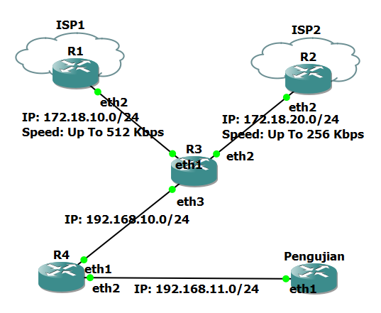

# PCC
Load balance PCC (Per-Connection Classifier)



## Konfigurasi ISP1
```sh mikrotik
/ip dhcp-client
add disabled=no interface=ether1
/ip dns set servers=8.8.8.8,8.8.4.4
/ip address add address=172.18.10.1/24 interface=ether2
/ip firewall nat 
add chain=srcnat out-interface=ether1 action=masquerade
#dhcp setup
/ip pool 
add name=dhcp_pool0 ranges=172.18.10.100-172.18.10.254
/ip dhcp-server 
add address-pool=dhcp_pool0 disabled=no interface=ether2\
    lease-time=1m name=dhcp1
/ip dhcp-server network
add address=172.18.10.0/24 dns-server=192.168.122.1,8.8.8.8\
    gateway=172.18.10.1

#queue
/queue simple
add name=lokal-lan target=172.18.10.0/24 max-limit=512k/512k
```
## Konfigurasi ISP2
```sh mikrotik
/ip dhcp-client
add disabled=no interface=ether1
/ip dns set servers=8.8.8.8,8.8.4.4
/ip address add address=172.18.20.1/24 interface=ether2
/ip firewall nat 
add chain=srcnat out-interface=ether1 action=masquerade
#dhcp setup
/ip pool 
add name=dhcp_pool0 ranges=172.18.20.100-172.18.20.254
/ip dhcp-server 
add address-pool=dhcp_pool0 disabled=no interface=ether2\
    lease-time=1m name=dhcp1
/ip dhcp-server network
add address=172.18.20.0/24 dns-server=192.168.122.1,8.8.8.8\
    gateway=172.18.20.1

#queue
/queue simple
add name=lokal-lan target=172.18.20.0/24 max-limit=256k/256k
```
## Konfigurasi R3
Konfigurasi R3
```sh mikrotik
/ip dhcp-client add disabled=no add-default-route=no interface=ether2
#dhcp client
/ip dhcp-client 
set 0 add-default-route=no
set 1 add-default-route=no
#dns client
/ip dns set servers=8.8.8.8,8.8.4.4
#source nat
/ip firewall nat 
add chain=srcnat out-interface=ether1 action=masquerade
add chain=srcnat out-interface=ether2 action=masquerade
#setup LAN
/ip address add address=192.168.10.1/24 interface=ether3
#dhcp setup
/ip pool 
add name=dhcp_pool0 ranges=192.168.10.100-192.168.10.254
/ip dhcp-server 
add address-pool=dhcp_pool0 disabled=no interface=ether3\
    lease-time=1m name=dhcp1
/ip dhcp-server network
add address=192.168.10.0/24 dns-server=192.168.122.1,8.8.8.8\
    gateway=192.168.10.1

#dhcp setup

/ip firewall mangle
add action=accept chain=prerouting dst-address=172.18.10.0/24
add action=accept chain=prerouting dst-address=172.18.20.0/24
add action=accept chain=prerouting dst-address=192.168.10.0/24
add action=mark-connection chain=prerouting in-interface=ether1 \
    new-connection-mark=ISP1 passthrough=yes
add action=mark-connection chain=prerouting in-interface=ether2 \
    new-connection-mark=ISP2 passthrough=yes
add action=mark-connection chain=prerouting comment="mark isp1 ke lokal" \
    in-interface=bridge1 new-connection-mark=ISP1 passthrough=yes \
    per-connection-classifier=both-addresses:2/0
add action=mark-connection chain=prerouting comment="mark isp2 ke lokal" \
    in-interface=bridge1 new-connection-mark=ISP2 passthrough=yes \
    per-connection-classifier=both-addresses:2/1
add action=mark-routing chain=prerouting comment="ke ISP1" connection-mark=ISP1 \
    in-interface=bridge1 new-routing-mark=keISP1 passthrough=yes
add action=mark-routing chain=prerouting comment="ke ISP2" connection-mark=ISP2 \
    in-interface=bridge1 new-routing-mark=keISP2 passthrough=yes
add action=mark-routing chain=output connection-mark=ISP1 new-routing-mark=\
    keISP1 passthrough=yes
add action=mark-routing chain=output connection-mark=ISP2 new-routing-mark=\
    keISP2 passthrough=yes

/ip route
add check-gateway=ping distance=1 gateway=172.18.10.1 routing-mark=keISP1
add check-gateway=ping distance=2 gateway=172.18.10.1 routing-mark=keISP1
add check-gateway=ping distance=1 gateway=172.18.20.1 routing-mark=keISP2
add check-gateway=ping distance=2 gateway=172.18.20.1 routing-mark=keISP2

```

## Konfigurasi R4
```sh mikrotik
#setup LAN
/ip address add address=192.168.11.1/24 interface=ether2
/ip dns set servers=8.8.8.8,8.8.4.4
/ip firewall nat
add chain=srcnat out-interface=ether1 action=masquerade
#dhcp setup
/ip pool 
add name=dhcp_pool0 ranges=192.168.11.100-192.168.11.254
/ip dhcp-server 
add address-pool=dhcp_pool0 disabled=no interface=ether2\
    lease-time=1m name=dhcp1
/ip dhcp-server network
add address=192.168.11.0/24 dns-server=192.168.122.1,8.8.8.8\
    gateway=192.168.11.1
```

pengujian
```sh mikrotik
/tool speed-test address=192.168.11.1
```