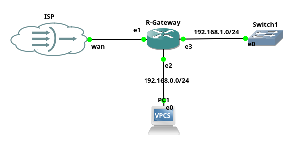

# Gateway
Mikrotik sebagai gateway adalah salah satu cara untuk menghubungkan klien dengan internet atau ISP. Mikrotik sebagai gateway menggunakan minimal dua LAN Card atau Ethernet sebagai router.

Tahapan Konfigurasi IP Public Static :
1. Set Identity Router
2. Add IP Address
- IP address/ether1 = 192.168.122.2/24 (Internet)
- IP address/ether2 = 192.168.0.1/24 (LAN1)
- IP address/ether3 = 192.168.1.0/24 (LAN2)
3. Set DNS
4. Add Routing
5. Set DHCP Server
6. Add NAT(SNAT) atau Masquerade

```sh
# Konfigurasi Identity Router :
/system identity set name=R-Gateway
# Konfigurasi menambah IP Address :
/ip address 
add address=192.168.122.2/24 interface=ether2 # ether1
add address=192.168.0.1/24 interface=ether3 # ether2
add address=192.168.1.1/24 interface=ether4 # ether3
# Konfigurasi menambah DNS :
/ip dns set allow-remote-requests=yes servers=8.8.8.8,8.8.4.4
# Konfigurasi menambah Routing :
/ip route add gateway=192.168.122.1
# Konfigurasi menambah DHCP Server :
/ip pool add name=dhcp_pool1 ranges=192.168.0.2
/ip dhcp-server
add address-pool=dhcp_pool1 disabled=no interface=ether3 name=dhcp1
/ip dhcp-server network
add address=192.168.0.0/24 dns-server=192.168.122.1,8.8.8.8,8.8.4.4 gateway=192.168.0.1
# Konfigurasi menambah NAT(SNAT) atau Masquerade :
/ip firewall nat add action=masquerade chain=srcnat out-interface=ether2
```